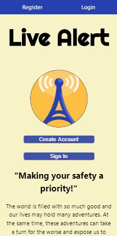
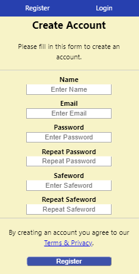
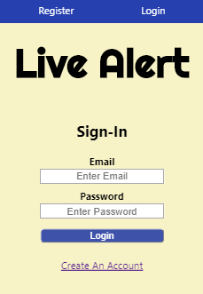
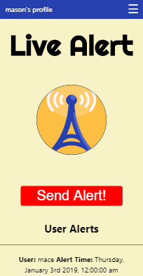
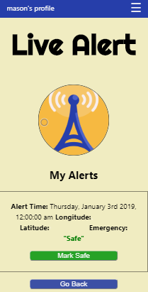
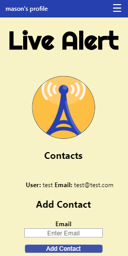
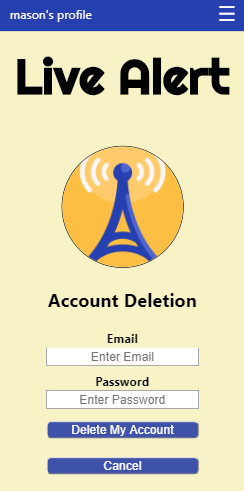

## Live-Alert App (Client)

---
Link: https://live-alert.now.sh/

## Summary
This is a safety app with the ability to create and delete a user account, login, add contacts (using contact email) that also use the app, and the ability to send out alerts for worrisome or life-threatening situations. The alert will be able to be seen by your added contacts and contains your screen name, the date and time the alert was sent, gps coordinates (longitude & latitude), safeword, and whether or not you are in a current emergency situation or if you have marked yourself as safe. If someone sends out an alert, their contacts should reach out to that user to verify they are ok, if the user doesnt answer or answers but doesnt use the safeword then the contact knows the user is still in a dangerous situation and should contact emergency services to your gps location.

## Image Guide

## Landing Page

## Sign-up Page

## Login Page

## Home Page

## My Alerts Page

## Contacts Page

## Delete Page

## Technology Used
React 

## Local Development Setup:
- Node: v16.20.2 (use `nvm use`)
- React Scripts: 3.4.4

## Available Scripts

In the project directory, you can run:

### `npm start`

Runs the app in the development mode. 
Open [http://localhost:3000](http://localhost:3000) to view it in the browser.

The page will reload if you make edits. 
You will also see any lint errors in the console.

### `npm test`

Launches the test runner in the interactive watch mode. 

### `npm run build`

Builds the app for production to the `build` folder. 
It correctly bundles React in production mode and optimizes the build for the best performance.

The build is minified and the filenames include the hashes. 
Your app is ready to be deployed!

### `npm run eject`

**Note: this is a one-way operation. Once you `eject`, you can’t go back!**

If you aren’t satisfied with the build tool and configuration choices, you can `eject` at any time. This command will remove the single build dependency from your project.

Instead, it will copy all the configuration files and the transitive dependencies (Webpack, Babel, ESLint, etc) right into your project so you have full control over them. All of the commands except `eject` will still work, but they will point to the copied scripts so you can tweak them. At this point you’re on your own.

You don’t have to ever use `eject`. The curated feature set is suitable for small and middle deployments, and you shouldn’t feel obligated to use this feature. However we understand that this tool wouldn’t be useful if you couldn’t customize it when you are ready for it.

